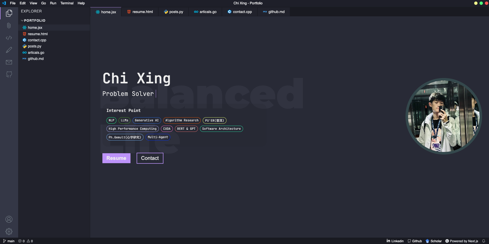

# 个人网站 - VScode主题（中文版）

Next.js构建并且部署在Vercel上。



## 环境变量

通过.env.local修改环境变量。详情见示例.env.local.example

## 运行

```bash
npm run dev
# or
yarn dev
```

打开 [http://localhost:3000](http://localhost:3000)即可

所有VSCode风格相关的组件存于`./components`文件夹，在`./pages`更改框架内容，通过修改 `./components/Sidebar.jsx` 和 `./components/Tabsbar.jsx`增加或删除页面

## 更多Next.js 学习资源

To learn more about Next.js, take a look at the following resources:

- [Next.js Documentation](https://nextjs.org/docs) - learn about Next.js features and API.
- [Learn Next.js](https://nextjs.org/learn) - an interactive Next.js tutorial.

You can check out [the Next.js GitHub repository](https://github.com/vercel/next.js/)

## 在Vercel部署

The easiest way to deploy your Next.js app is to use the [Vercel Platform](https://vercel.com/new?utm_medium=default-template&filter=next.js&utm_source=create-next-app&utm_campaign=create-next-app-readme) from the creators of Next.js.

Check out our [Next.js deployment documentation](https://nextjs.org/docs/deployment) for more details.
